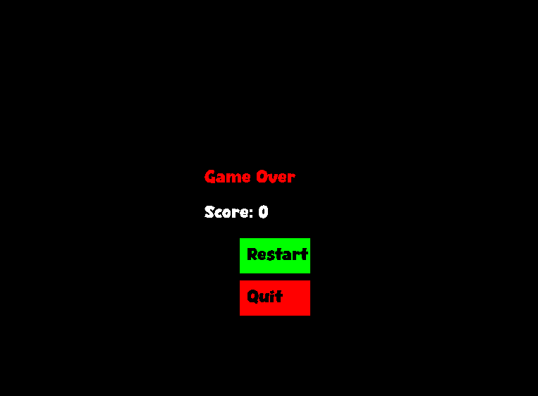

# Snake Game

A classic Snake game implemented in C++ using SDL2. This project demonstrates basic game development concepts, including rendering, event handling, and game logic.

## Features

- Classic Snake gameplay
- Simple and intuitive controls
- Colorful graphics
- Score tracking
- Game over screen with restart and quit options

## Screenshots

## Getting Started

### Prerequisites

- Visual Studio with C++ development tools
- SDL2
- SDL2_ttf
- SDL2_image

### Building

1. Clone the repository:
    git clone https://github.com/mroeb/Snake.git
    cd snake-game

2. Open the project in Visual Studio:
    - Open Visual Studio.
    - Select **File > Open > Project/Solution**.
    - Navigate to the `snake-game` directory and open the `.sln` file.

3. Set up SDL2, SDL2_ttf, and SDL2_image:
    - Download the development libraries for SDL2, SDL2_ttf, and SDL2_image.
    - Extract the contents and copy the `include` and `lib` folders to your project directory.
    - In Visual Studio, right-click on the project in the Solution Explorer and select **Properties**.
    - Under **Configuration Properties > VC++ Directories**, add the paths to the `include` and `lib` folders for SDL2, SDL2_ttf, and SDL2_image.
    - Under **Configuration Properties > Linker > Input**, add `SDL2.lib`, `SDL2main.lib`, `SDL2_ttf.lib`, and `SDL2_image.lib` to the **Additional Dependencies**.

4. Build the project:
    - Select **Build > Build Solution**.

### Running

1. Copy the `resources` folder to the output directory (e.g., `Debug` or `Release` folder where the executable is located).

2. Run the executable generated in the output directory:  
    .\Debug\snake-game.exe

## Controls

- **Arrow Keys**: Move the snake
- **Enter**: Select menu options

## Folder Structure
project/ 

│ ├── include/ 

│ ├── SDL dependencies

│ ├── src/ 

│   ├── main.cpp 

│ ├── resources/ 

│   ├── font/ 

│   │   └── Silvertones.ttf 

│   └── icon.png 

└── README.md

## Contributing

Contributions are welcome! Please open an issue or submit a pull request for any improvements or bug fixes.

## License

This project is licensed under the MIT License. See the [LICENSE](LICENSE) file for details.

## Acknowledgments

- [SDL2](https://www.libsdl.org/)
- [SDL2_ttf](https://www.libsdl.org/projects/SDL_ttf/)
- [SDL2_image](https://www.libsdl.org/projects/SDL_image/)

---

Made with ❤️ by [Mika](https://github.com/mroeb)
